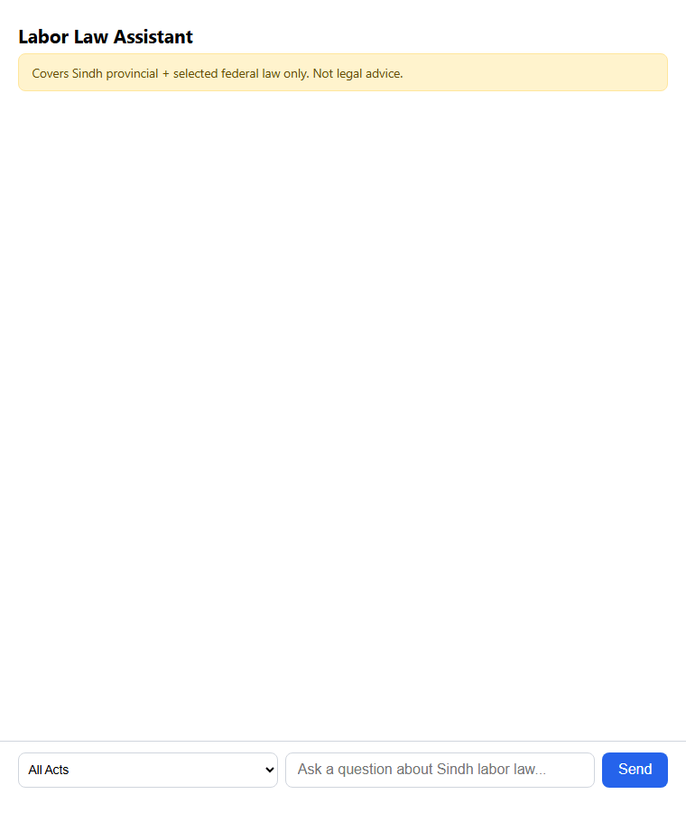
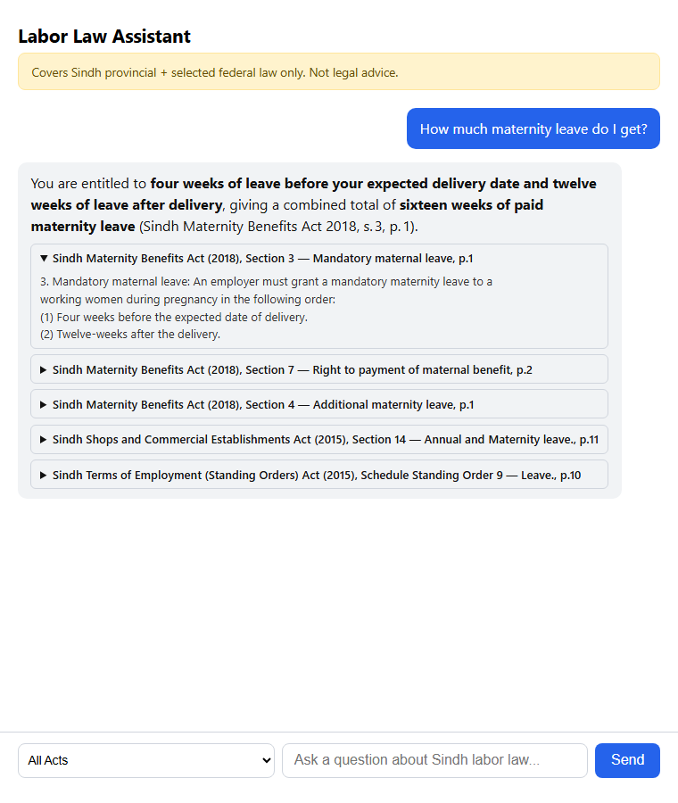
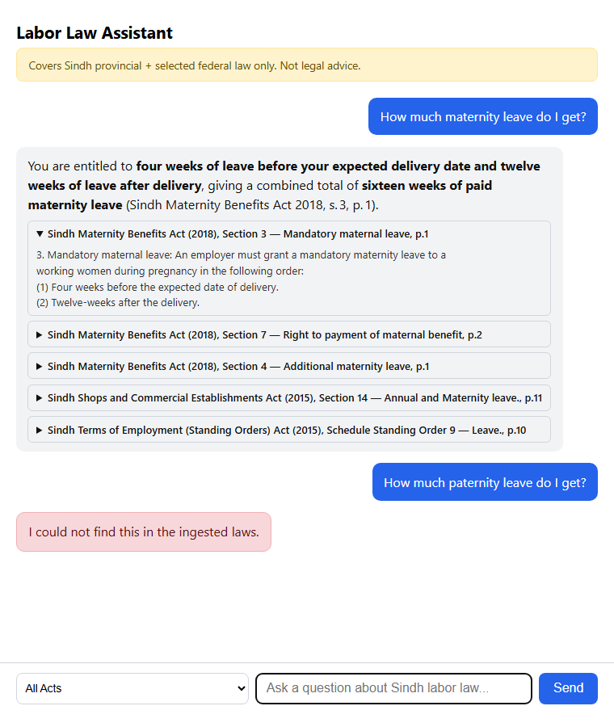
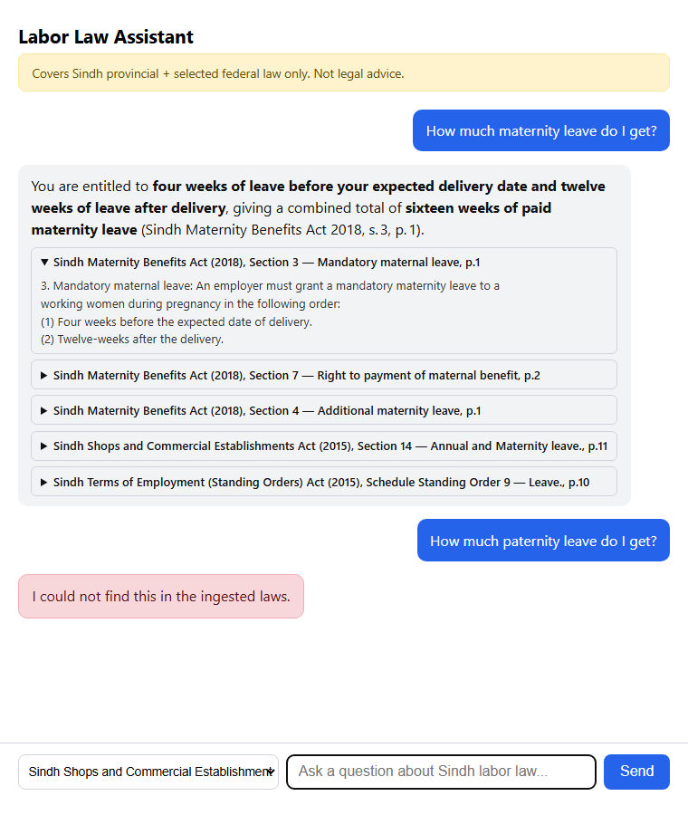
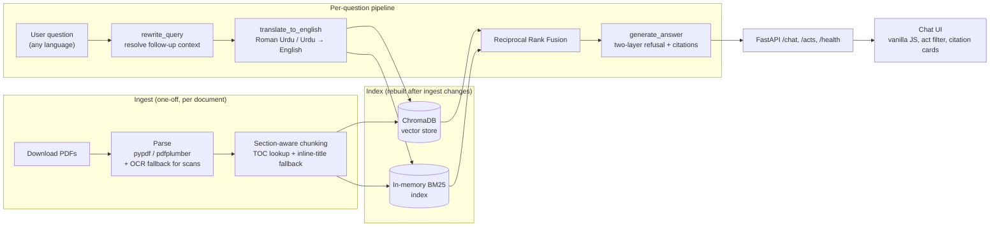

# Labor Law Assistant (Sindh, Pakistan)

A RAG chatbot that answers questions about Sindh (and selected federal) Pakistani labor law — every answer cites the exact act, section, and page it came from, and the system refuses outright rather than guessing when it can't find a real answer. Built as a portfolio project across 6 milestones, each one measured and documented, not just shipped.

**Scope disclaimer:** Covers Sindh provincial + selected federal law only. Not legal advice.

## The problem

Labor law questions ("how much notice before I can be fired?", "how many days of sick leave do I get?") have real, specific, citable answers buried across half a dozen dense legal acts. A generic LLM will answer confidently either way — correctly, or by hallucinating a plausible-sounding but wrong section number. For a legal-adjacent tool, a confident wrong answer is worse than an honest "I don't know." So the two hard requirements driving every design decision here are: **every claim must cite where it came from**, and **the system must refuse rather than guess** when retrieval doesn't actually support an answer.

## Demo



A real maternity-leave question answered and cited, followed by a paternity-leave question the corpus genuinely doesn't cover — refused, not hallucinated.

| | |
|---|---|
|  |  |
| A cited, correct answer with the source excerpt expanded | The exact same session refusing a question the corpus doesn't cover |

Milestone 5 also added an Act filter (`GET /acts`, `act_filter` on `POST /chat`), so results can be restricted to one Act:



## Architecture



Two things worth calling out that aren't obvious from the diagram: retrieval's reciprocal rank fusion decides *which* chunks to show the LLM, but the refusal gate checks the *original vector distance* separately, not the fused score — RRF's fused score turned out not to be a usable relevance signal (see below). And `translate_to_english` and `rewrite_query` use different models — translation accuracy is unrecoverable downstream if it's wrong, so it gets the more capable model even though it costs more.

## Key decisions & trade-offs

- **Section-aware chunking, not fixed-size windows.** Legal text must never be split mid-section for citation accuracy. Section titles are looked up from each document's own table of contents rather than parsed from body text, because 4 of the first 5 core acts ingested have a PDF column-layout artifact that extracts a section's title *after* its body, not before — parsing titles directly out of order would have silently mislabeled sections. One document (the Maternity Benefits Act) has no TOC at all; a narrowly-scoped inline-title fallback handles it without weakening the "never guess a title" rule for documents that do have a TOC with genuine gaps.
- **Multilingual embeddings, with a real, measured limitation.** `paraphrase-multilingual-mpnet-base-v2` was chosen specifically so Urdu/Roman Urdu queries would work. Testing found that's only partly true: proper Urdu script retrieves noticeably worse than English, and Roman Urdu worse still — not purely a romanization artifact, since even correct Urdu script underperforms. The fix wasn't a better embedding model; it was translating the query to English before retrieval, since English retrieval is reliably strong.
- **Three LLM providers tried before one actually fit.** Anthropic worked but requires a card on file. Google Gemini's "free tier" also gates the generation endpoint behind a linked billing account, confirmed via the actual AI Studio dashboard. Groq's free tier is genuinely cardless and is what shipped.
- **Two-layer refusal, because neither layer alone is reliable.** A score-threshold pre-filter catches obviously irrelevant queries cheaply, with no LLM call. But a "leave" query can retrieve leave-related chunks by topical similarity without any of them answering the *specific* thing asked (maternity chunks retrieved for a paternity question) — scoring fine on distance while still being the wrong answer. A second, LLM-level instruction refuses if the retrieved excerpts don't actually answer the question, even after passing the score filter.
- **Hybrid search fixed a real retrieval bug — but not everywhere.** Pure vector search reliably mis-ranked queries mentioning "Sindh" or a full Act name: the generic "short title" section of an *unrelated* act would outrank the real answer, since dense embeddings can't down-weight boilerplate the way BM25's IDF does. Adding BM25, merged via reciprocal rank fusion, fixed this — but a query naming an Act's *exact, complete* name defeats even BM25, since that Act's own short-title section restates its full name almost verbatim. That needed a second fix: tightening the query-rewriter's prompt to stop padding follow-up queries with full Act names in the first place.

## What broke, and how it was fixed

The full incident log is in [PROGRESS.md](PROGRESS.md) — milestone by milestone, including the ones that didn't make this shortlist. A few of the more instructive ones:

- **Chunker false positives (Milestone 2).** A wrapped line like "...Act, 2015." was mistaken for a new section boundary (a bare 4-digit year read as a section number); a cross-reference like "under section \n14." split into a fake section. Both found by inspecting real chunker output against the real documents, not anticipated in advance, and fixed with a digit-count cap and a monotonicity filter respectively.
- **A silent regression in the OCR pipeline.** The one scanned document (a minimum-wage gazette notification) was OCR'd once via a narrowly-scoped fallback script. A later, routine re-run of the main parsing pipeline (to pick up an unrelated new document) silently overwrote that OCR'd text with empty text, because the main parser doesn't know how to OCR — it just correctly flags scanned documents without fixing them. Caught by inspecting chunk output, not by a test (none existed for this). Fixed, and a CLI warning was added so an empty-text chunk can never again pass through silently.
- **The eval framework (`ragas`) broke the environment before it broke anything else.** Installing it corrupted the project's own numpy install — no prebuilt numpy wheel exists for Python 3.13, so pip silently fell back to building numpy from source, producing a broken MinGW binary that segfaulted on a bare `import numpy`. Separately, `ragas` itself has a hard, unconditional import of an unused Google Vertex AI integration that doesn't exist in current `langchain-community`. Abandoned for a from-scratch implementation of the same four RAGAS-style metrics as direct LLM-judge prompts against the Groq client already in use.
- **Two citation-fidelity bugs found by the eval, not by inspection.** The model would sometimes name the Act mentioned in the *user's question* in its prose, even when a completely different Act was actually retrieved and cited — echoing the question's framing rather than its own source. And a "rates may have changed" caveat was firing whenever any retrieved chunk was flagged as potentially superseded, even if that chunk was never actually cited in the answer. Both fixed with regression tests.
- **A translation bug found by root-causing an eval regression, not by assuming noise.** After adding hybrid search, one Roman Urdu question that used to pass started failing. Direct reproduction showed why: `translate_to_english("...kam se kam tankhwah kitni hai?")` — "what is the minimum *wage*?" — came back as "what is the minimum **temperature**?" from the small, fast model used elsewhere for cheap tasks. A second attempt at the same translation produced a *different* wrong answer ("minimum percentage of votes"). The larger model got it right, consistently, on the first try — switched just that one call to it.

## Evaluation results

A 53-question hand-written eval set (`eval/testset.jsonl`) covers answerable questions, questions the corpus genuinely doesn't cover (expected refusals), and multi-turn follow-ups — including Roman Urdu phrasing throughout. Four LLM-judge metrics (faithfulness, answer relevancy, context precision, context recall) score answerable questions; refusals are scored by an explicit correct/incorrect rule per question, not vibes.

**Milestone 4, v1 → v2 (testset correction, before any retrieval changes):** two of the original eval questions turned out to be wrong — the corpus actually did answer them (found by grepping the corpus directly, not assumed) — and were corrected. Refusal accuracy: 9/12 → 11/12.

**Milestone 5 (hybrid search + Roman Urdu translation), the headline result:**

| Metric | Before (vector only) | After (hybrid + translation) |
|---|---|---|
| Faithfulness | 0.763 | **0.895** |
| Answer relevancy | 0.841 | **0.939** |
| Context precision | 0.724 | **0.825** |
| Context recall | 0.746 | **0.873** |
| Refusal accuracy | 11/12 | 11/12 |
| Follow-up subject-naming | 10/10 | 10/10 |

Recorded honestly, not just the aggregate: of 58 individually-scored cases, **6 were fixed, 1 newly failed, 2 were already failing and remain so, 49 were unchanged.** The 1 regression was root-caused (a pre-existing retrieval gap that a second LLM call happened to react to differently, not a deterministic effect of hybrid search) and deferred with a written reason rather than quietly excluded. Full per-question breakdown in [PROGRESS.md](PROGRESS.md).

## Limitations

- Two retrieval gaps remain open: a worker-classification question and a gratuity question both fail to surface the right section in the top-5, under either vector search, BM25, or their fusion — not yet root-caused to a fix, only to a cause.
- Roman Urdu test coverage is 2 questions. Both now pass, but that's a thin sample for a "multilingual support" claim.
- Three acts are explicitly out of scope for now: the Sindh Factories Act, Employees' Old-Age Benefits Act, and Workers' Compensation Act (Phase 2, never started).
- Single LLM provider (Groq's free tier) — subject to that tier's daily token quota, hit more than once during development.
- The BM25 index is rebuilt in-memory per process on first use, not persisted — fine at ~250 chunks, would need revisiting at real scale.

## Roadmap

- Ingest the three Phase 2 acts.
- Root-cause and close the two open retrieval gaps.
- Broaden Roman Urdu / Urdu Script test coverage beyond 2 questions.
- A second LLM provider for redundancy against Groq's rate limits.

## Setup

```bash
python -m venv .venv
source .venv/bin/activate        # or .venv\Scripts\activate on Windows
pip install -r requirements.txt
cp .env.example .env             # add your GROQ_API_KEY — see .env.example
```

## Running the full pipeline

```bash
python -m ingest.download    # downloads core source PDFs into data/raw/
python -m ingest.parse       # extracts per-page text into data/interim/
python -m ingest.chunk       # section-aware chunking into data/processed/
python -m retrieval.index    # embeds chunks into the local Chroma store

uvicorn api.main:app --reload  # backend on :8000
python -m http.server 8080 --directory frontend  # frontend on :8080
```

Then open `http://127.0.0.1:8080` in a browser. Each ingestion command prints a summary table and exits non-zero if a document needs attention (a failed download, a missing URL, a likely-scanned PDF) — see `PROGRESS.md` for the current list of resolved and open items.

## Tests

```bash
pytest
```

74 tests, no real network/API calls — every LLM and retrieval call is mocked at the unit level; live behavior is verified separately and documented in `PROGRESS.md`.

## Evaluation

```bash
python -m eval.run                    # full run
python -m eval.run "A1,A2,R1"         # a specific batch (resumable via checkpoint)
```

## Project structure

```
labor-law-assistant/
├── ingest/          # PDF download, parsing, section-aware chunking
├── retrieval/       # ChromaDB vector store + BM25, reciprocal rank fusion
├── api/             # FastAPI app: query rewriting, translation, generation
├── eval/            # 53-question test set + custom LLM-judge eval pipeline
├── frontend/        # single-page vanilla JS chat UI
├── docs/            # screenshots + demo GIF for this README
├── data/raw/         # downloaded PDFs (gitignored)
├── data/interim/     # per-page parsed text (gitignored)
├── data/processed/   # chunked JSON (gitignored, rebuildable)
└── tests/
```

## Docs
- [SPEC.md](SPEC.md) — full milestone-by-milestone build plan
- [PROGRESS.md](PROGRESS.md) — what was built, what broke, every metric, per milestone
- [Project rules](.md) — hard requirements this build had to satisfy throughout
